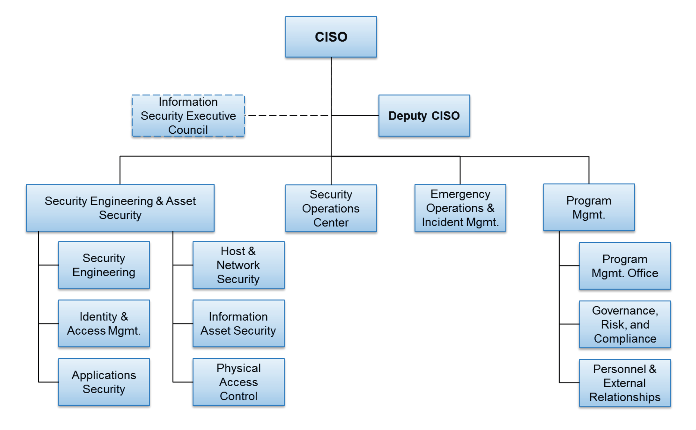

# Managing Cyber Threats for a Higher Education Institution

## My Role as a CISO

As the Chief Information Security Officer (CISO) here at Cytroy, my primary job is to ensure the Confidentiality, Integrity and Availability of information stored and processed by the university. This involves making decisions about network architecture, firewalls and segmentation. Additionally, I have to review contracts such as those for research funding or for cloud platforms such as Office 365. I have to look at where data will be stored and check that the organisation is certified with an appropriate security framework. I am also the point of contact for law enforcement[^1] when there is a suspected data breach or concern. Within the university, I work with many departments to ensure the necessary technology is available to them. This involves doing things such as opening firewall ports and setting up databases.

When I started working in IT, the CISO role was more focused on IT Security, whereas it is now more general and covers information security risk management in addition to IT security. This means along with securing hardware and software, using firewalls and intrusion detection systems, we have to map out our internal and external threats; as a university we have a lot of internal threats including dissatisfied students and staff. I have to manage and develop information security policies, procedures and controls, and I have to manage the risk framework that we use. 

When working in IT as a junior technician, we always put security first, but as a CISO I have to balance risk with the business plan and develop policies that provide protection, without interfering with core business requirements.[^2] As there is risk associated with all IT systems, no matter how much it is 'hardened', we plan and test responses for security breaches. Part of my role in planning for breaches involves ensuring all systems have auditing and logging software installed and configured.

## The Team

The University of Cytroy is a large institute which can be difficult to manage, but by breaking down the security role into separate departments it can be made easier. These departments include emergency / incident response, the security operations centre, programme management and security engineering and asset security.[^3] I work with a deputy CISO and the Security Executive Council to make decisions and run the different teams. The Security Executive Council help me to ensure security requirements are met, policies and plans are implemented and compliance requirements are met. It is made up of stakeholders from within the organisation, including the Chief Operations Officer, Chief Information Officer, Chief Security Officer and General Counsel.

__CISO Organizational Structure[^3]__

The Programme Management department are responsible for developing and implementing an information security plan, a risk management programme and managing relationships with external organisations.

The Security Operations Centre (SOC) is responsible for setting up and monitoring security logs, analysing and managing threats and vulnerabilities and detecting and responding to security incidents.

Emergency Operations work with the SOC and is responsible for activating response plans and carrying out time-critical response activities following notification of a significant incident. As there is usually no breach occuring, this department spends most of their time planning incident response and testing these plans. After an incident they are responsible for forensic analysis, to identify the cause of the incident. During this they work with law enforcement to aid the official investigation.

At the University of Cytroy we combine the Security Engineering and Asset Security into one organisational unit, as it promotes 'greater collaboration and cooperation'. Security Engineering involves developing security requirements with the CIA of information assets in mind, developing and maintaining secure architecture and enforcing a secure software development lifecycle; ensuring security requirements are being fulfilled. The Asset Security department are responsible for managing identities and access controls so that assets are available to those who should have access, but confidential in that those who are not authorised should not be able to access them. 

## Higher Education as a target

Higher education institutions are attractive targets for cyber criminals as they store lots of personal information, bank details and sensitive research.[^1]

Research is a target as it could be valuable to an attacker, or because it is valuable to the university. Ransomware attacks take advantage of the latter, for example the University of Calgary suffered a ransomware attack in 2016, and paid $20,000 ransom as they could not afford to lose their 'world class research'. [^4]

Universities often conduct sensitive research for governmental bodies, including military and intelligence bodies. Cybersecurity firm iDefense reported that 27 US Universities were targetted by Chinese hackers to access research contracted for the US Navy.[^5] Recently there have been suspected attempts by the Russian hacker group known as 'APT29' to access research around SARS-CoV-2 vaccine development.[^6]

The most common form of cyber attacks are through phishing campaigns. Students spend a lot of time online and often do not consider the risk of having their credentials and other data stolen, making them susceptible to phishing.[^7] At the University of Cytroy we have observed lots of phishing attempts, so we have extended our phishing training to include students as well as staff. Education and awareness is especially important as it is not only how students and staff act when using our networks that affects us - with our 'Bring Your Own Device' policy, which is now very common in higher education, devices which have become infected by users at home now pose a risk when connected to our networks.

Higher Education institutions store a large amount of personal data about staff and students, which is important to protect. With the introduction of the GDPR we have focused more on this, appointing a Data Protection Officer and having regular audits to ensure compliance. The consequences of failing to protect personal data can be devastating for Universities, which already have low budgets as they run as charities. In 2016, Greenwich University suffered two security breaches which had to be reported to the Information Commissioners Office (ICO), resulting in a £96k fine.[^8]

## How my Role has changed with the introduction of GDPR

Since the introduction of GDPR in 2016, with the regulation coming into effect in 2018, there have been significant changes in my role at the university. There is a stronger focus on Personally Identifiable Information (PII) - any PII that is stored and processed must be necessary, and must be stored securely. 

GDPR requires that we appoint a Data Protection Officer (DPO) as we have 'regular and systematic monitoring of data subjects on a large scale'. As the CISO I don't have an overview of all the sensitive information assets we store, and it is recommended that internal executives are not appointed as DPO [^9]. The role of DPO is intended to be as an 'independent auditor', which has conflicting interests with executives whose primary goals are to protect business interests. A DPO from the Programme Management department was appointed in 2017 during our preparation for GDPR readiness. I work closely with the DPO and other teams to ensure GDPR compliance. This involves identifying where PII is collected, processed and stored and ensuring that all collected data is necessary and is stored securely. We use the Data Protection Impact Assessment (DPIA) to identify and minimise risks.[^10]

To comply with Article 15 of the GDPR, we have to make data accessible to all students and staff.[^11] Due to the number of students and staff at the university, we cannot manually fulfil all requests for access, so we've set up an interface on the staff and student portal to allow them to download all information we store about them. In addition to this, there are options to rectify information, and request for all data to be deleted; meaning we comply with articles 16 and 17 of the GDPR.

A key activity we have introduced is staff training around GDPR, from executives to those who implement systems which collect PII. This is important as teams need to identify PII that they collect in order to report it to the DPO and discuss how to secure it.

## Final Word

I hope this blog has been helpful in giving you an understanding of my role at this University. If you have any questions or concerns related to the Cyber Security of our University (or anything else!), please get in touch at [anthony.graham@cytroy.ga](mailto:anthony.graham@cytroy.ga)

## References

[^1]: Anft, M (2020) Managing a Changing Threat. The Chronicle of Higher Education. 
[^2]: Cho, M (2003) Mixing Technology and Business: The Roles and Responsibilities of the Chief Information Security Officer. SANS Institute, Information Security Reading Room. 
[^3]: Allen, J., Crabb, G., Curtis, P., Fitzpatrick, B., Nehravari, N., Tobar, D. (2015) Structuring the Chief Information Security Officer Organisation. Carnegie Mellon University, Software Engineering Institute. 
[^4]: Swivelsecure. Why Cybersecurity needs to be a Priority for the Education Sector. [online] Available from: https://swivelsecure.com/solutions/education/why-cybersecurity-needs-to-be-a-priority-for-the-education-sector/ (Accessed 18th November 2020). 
[^5]: Liao, S. (2019) Chinese hackers reportedly targeted 27 universities for military secrets. [online] Available from: https://www.theverge.com/2019/3/5/18251836/chinese-hackers-us-servers-universities-military-secrets-cybersecurity (Accessed 20th November 2020).
[^6]: NCSC. (2020) Advisory: APT29 targets COVID-19 vaccine development. [online] Available from: https://www.ncsc.gov.uk/news/advisory-apt29-targets-covid-19-vaccine-development (Accessed 20th November 2020). 
[^7]: Hunt, T. (2016) Cyber Security Awareness in Higher Education. Central Washington University. 
[^8]: Maguire, D. (2019) Dealing with cyber security threats to universities and colleges. [online] Available from: https://www.jisc.ac.uk/blog/dealing-with-cyber-security-threats-to-universities-and-colleges-25-sep-2019 (Accessed 20th November 2020). 
[^10]: PRIVACYPROFICIENT. (2020) Can a CISO be a DPO? [online] Available from: https://privacyproficient.com/can-a-ciso-be-a-dpo/ (Accessed 24th November 2020). 
[^11]: ICO. What is a DPIA? [online] Available from: https://ico.org.uk/for-organisations/guide-to-data-protection/guide-to-the-general-data-protection-regulation-gdpr/data-protection-impact-assessments-dpias/what-is-a-dpia/ (Accessed 24th November 2020). 
[^12]: European Parliament and Council of European Union (2016) Regulation (EU) 2016/679. Available at: https://eur-lex.europa.eu/legal-content/EN/TXT/HTML/?uri=CELEX:32016R0679&from=EN (Accessed: 5th December 2020).
